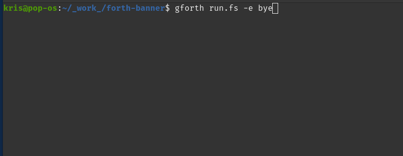

# Banner command in GForth

Simple banner command rewrite in GForth

```
$ gforth run.fs
  ok
s" BANNER" banner 
 #####     ##    ##  ##  ##  ##  ######  #####                                  
 ##  ##   ####   ### ##  ### ##  ##      ##  ##                                 
 ##  ##  ##  ##  ######  ######  ##      ##  ##                                 
 #####   ######  ######  ######  ####    #####                                  
 ##  ##  ##  ##  ## ###  ## ###  ##      ####                                   
 ##  ##  ##  ##  ##  ##  ##  ##  ##      ## ##                                  
 #####   ##  ##  ##  ##  ##  ##  ######  ##  ##                                 
                                                                                
 ok

```

As a bonus, there is also a scroll in terminal included in the code, that you can run with the following command:

